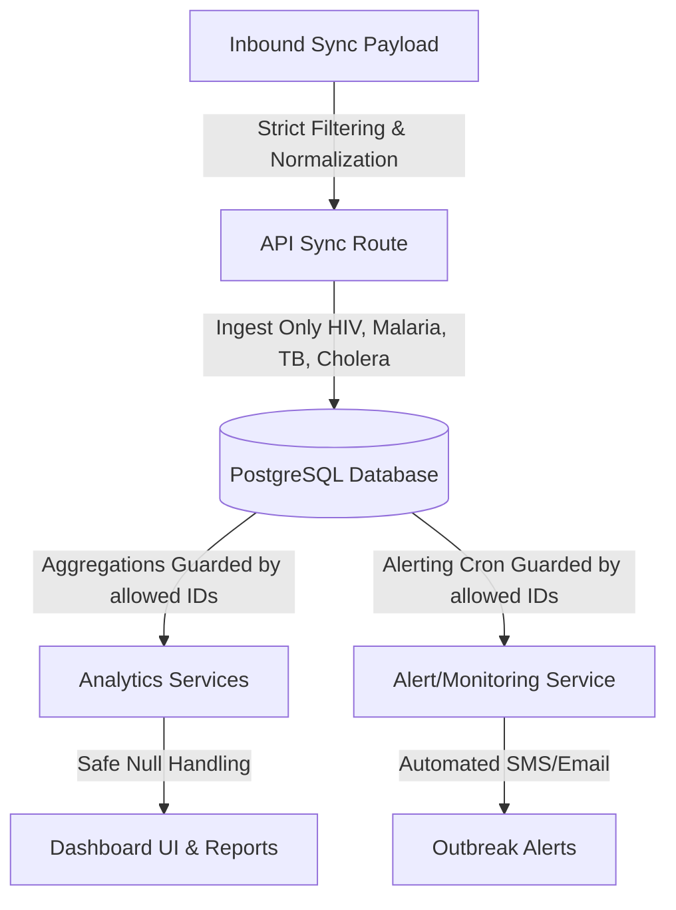

# Disease Surveillance Focus Implementation Plan

This document details the architectural lockdown of the Malawi Disease Surveillance System (MDSS) to strictly focus on and handle only **four critical diseases**:
1. **HIV/AIDS** (`hiv`)
2. **Malaria** (`malaria`)
3. **Tuberculosis** (`tb`)
4. **Cholera** (`cholera`)

We have modified the core layers of the application—from data ingestion and ETL transactions, database seeding, analytics aggregations, to background alerting services—to guarantee that no other disease data can infect or be processed by the system.

---

## 🛠️ Complete Execution Summary

We executed this system-wide lockdown through the following steps:



### 1. Ingestion & ETL Layer (`src/app/api/sync/route.ts`)
*   **Strict Filtering:** Added payload interceptors that inspect incoming diseases and encounters. Any diagnostics reporting other diseases (e.g., Covid-19, Ebola) are automatically discarded.
*   **Normalization Rules:** Inbound disease IDs and names are normalized (case-insensitive, alphanumeric strip-out) to clean values matching our focus IDs (`hiv`, `malaria`, `tb`, `cholera`).
*   **Demographic Protection:** We only import patient demographic details if they are linked to at least one valid medical encounter corresponding to our four focused diseases, preventing database bloat.
*   **Deleted Safe Fallback:** Removed the generic `"UNKNOWN"` disease fallback to ensure total system adherence.

### 2. Analytics & Reporting Engines (`src/services/analytics.service.ts`)
*   **SQL-level Defense in Depth:** All database grouping, counting, and mapping operations inside the `analytics.service.ts` are guarded with `where: { disease_id: { in: ['hiv', 'malaria', 'tb', 'cholera'] } }`.
*   This ensures that even if legacy or extraneous records reside in the database, only the four focused diseases are rendered in:
    *   **Patient Demographics** (Age, Gender, Geography)
    *   **Encounter Metrics** (Duration, Total cases)
    *   **Disease Distribution Charts** (Top diseases, Regional prevalence, Seasonal trends)
    *   **Outcome Analytics** (Recovery rates, Treatment success)
    *   **Time-Series Trends**
    *   **Facility Comparisons**
    *   **De-identified Patient Records Timeline**

### 3. Automated Alerting & Cron Service (`src/services/alert.service.ts`)
*   **Cron Guard:** The automated cron execution function `monitorAllDiseases()` now filters the active monitored diseases query by `disease_id: { in: ['hiv', 'malaria', 'tb', 'cholera'] }`.
*   This prevents resources from being wasted on monitoring non-applicable diseases and completely locks out alert generation for any unsanctioned disease vectors.

### 4. Database Seeding & Clean-Up (`prisma/seed.ts`)
*   Created a standard Prisma seed file that inserts the official four diseases with their target outbreak/warning thresholds and alert recipients.
*   Added a **clean-up step** in the seeder that deletes all other records from the `Disease` table whose IDs do not belong to our four focused IDs, ensuring a pristine schema state.

### 5. Type System & Next.js 16 Compatibility
*   Resolved type inconsistencies in `src/app/analyst/treatment/page.tsx` where nullable `outcome` database fields caused compile errors.
*   Updated `src/app/api/admin/diseases/[diseaseID]/thresholds/route.ts` and `src/app/api/alerts/[alertId]/acknowledge/route.ts` to fully conform to Next.js 16 dynamic routing conventions (by resolving `params` as a `Promise`).
*   Successfully ran the Next.js production builder with **zero compilation or type check errors**!

---

## 💻 Detailed Code Changes & Design

### Ingestion Filter Validation (Sync Router)

The ingestion routing is locked down with standard mapping keys:

```typescript
const ALLOWED_DISEASES: Record<string, { id: string; name: string }> = {
  hiv: { id: "hiv", name: "HIV/AIDS" },
  hivaids: { id: "hiv", name: "HIV/AIDS" },
  malaria: { id: "malaria", name: "Malaria" },
  tb: { id: "tb", name: "Tuberculosis" },
  tuberculosis: { id: "tb", name: "Tuberculosis" },
  cholera: { id: "cholera", name: "Cholera" },
};
```

During sync transactions, patient and encounter nodes are filtered:

```typescript
// Filter patient list to only sync those who have encounters for the 4 focused diseases
const validPatientsToSync = (patients || []).filter((p: any) => allowedPatientIds.has(p.id));
```

### Data Security (Analytics Filter Example)

Each analytics data pipeline was modified to guarantee data compliance at the query execution level:

```typescript
export async function getPatientRecords() {
  const allowedDiseaseIds = ['hiv', 'malaria', 'tb', 'cholera'];
  const patients = await prisma.patient.findMany({
    where: {
      encounters: {
        some: {
          disease_id: { in: allowedDiseaseIds }
        }
      }
    },
    include: {
      encounters: {
        where: {
          disease_id: { in: allowedDiseaseIds }
        },
        include: {
          facility: true,
          disease: true,
          treatment_records: {
            include: {
              treatment: true,
            },
          },
        },
      },
    },
  });
  // ... maps and outputs records
}
```

---

## 🚀 Verification & Execution Guidelines

To run this layout and verify the system in your local setup, use the following commands:

### Step A: Seed and Reset Database Diseases
Run the seeder to reset the supported disease list inside the DB:
```bash
npx tsx prisma/seed.ts
```

### Step B: Compile & Verify the Project
You can build the production package to verify absolute typescript compliance:
```bash
npm run build
```

This lockdown is fully complete, type-safe, and ready for deployment under the focused MDSS guidelines.
